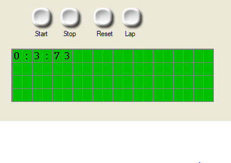

# ⏱️ Digitalna Stoperica u Flowcode

Ovo je **digitalna stoperica** napravljena u **Flowcode-u**.  
Omogućava jednostavno mjerenje vremena sa funkcijama **Start**, **Stop**, **Reset** i **Lap**.  

---

## 🎛️ Funkcije dugmadi

| Dugme | Za šta služi | Emoji |
|-------|--------------|-------|
| Start | Pokreće stopericu | ▶️ |
| Stop  | Zaustavlja stopericu | ⏸️ |
| Reset | Vraća vrijeme na nulu | 🔄 |
| Lap   | Zabilježava međuvrijeme | 📋 |

---

## 📂 Lokacija projekta

Projekat se nalazi u folderu:  
flowcode/stoperica.flowcode

Pokreni ga u **Flowcode simulatoru** i koristi dugmad kako je opisano.  

---

## 👤 Autor

**Arsen Ramić**
